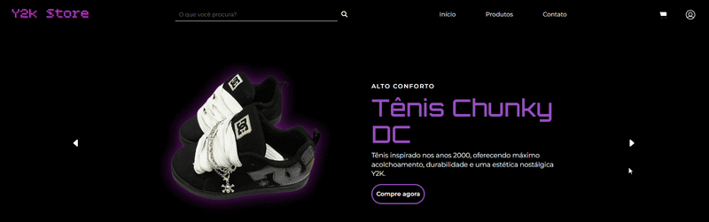

# Y2k E-commerce

E-commerce interface inspired by 2000s (Y2K) Fashion. I built this project to practice and improve my web development skills.

# Technologies used:

* HTML5
* CSS3
* JavaScript
* Bootstrap

# Features:

- [x] Adapted layout for mobile devices

- [x] Interactive Carousel with sliding item transitions

- [x] Menu grid
